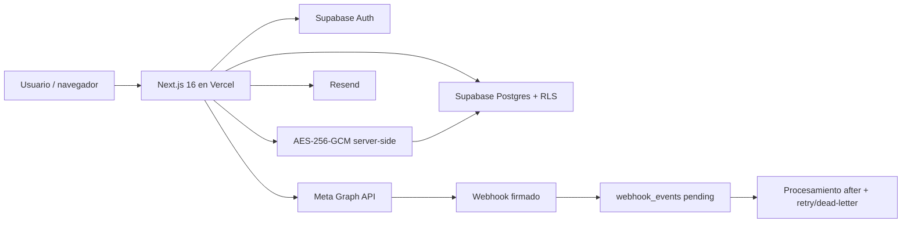

# Informe técnico de cierre — Estructura Digital SaaS

Fecha de revisión: 2026-07-30. Rama: `codex/production-hardening`. Producción permanece en el commit base `4968d5c` hasta autorizar respaldo, migración y despliegue.

## Estado ejecutivo

**Aprobado con bloqueos de producción.** La implementación local, pruebas y build están completas para el alcance automatizable. No se aplicó la migración ni se desplegó porque el cambio activa eliminación real de datos, nuevas RLS/RPC y requiere respaldo/autorización. El E2E real de Meta también requiere selección humana.

## Arquitectura final

La organización activa se guarda en cookie HttpOnly/SameSite y se vuelve a validar contra `organization_members` en cada request. Service role, secretos Meta y clave AES son solo servidor.

## Endpoints

| Método | Ruta | Control |
|---|---|---|
| POST | `/api/contact` | Público, honeypot, schema, 5/10 min/IP distribuido |
| GET/POST | `/api/meta/embedded-signup/session` | Supabase, Owner/Admin, rate limit, state/nonce, Origin/Host en mutación |
| GET | `/api/meta/oauth/start` | Fallback interno, Supabase, Owner/Admin, rate limit |
| GET | `/api/meta/oauth/callback` | Fallback, state/cookie; redirige al SDK canónico |
| GET/POST | `/api/meta/webhook` | Verify token / firma HMAC, persistencia antes de 200 |
| POST | `/api/meta/data-deletion` | signed_request de una única app, rate limit, ejecución real |
| GET | `/data-deletion/status/[code]` | Código UUID opaco; campos mínimos |
| POST | `/api/meta/disconnect` | Supabase, Owner/Admin, CSRF, rate limit |
| POST | `/api/meta/revalidate` | Supabase, Owner/Admin, CSRF, rate limit |
| POST | `/api/whatsapp/send` | Supabase, Owner/Admin, CSRF, límites usuario+org |
| GET | `/api/whatsapp/status` | Supabase y filtro de organización |
| GET | `/auth/callback` | PKCE Supabase y redirect interno validado |

## Variables de entorno utilizadas — solo nombres

`NEXT_PUBLIC_SITE_URL`, `NEXT_PUBLIC_SUPABASE_URL`, `NEXT_PUBLIC_SUPABASE_ANON_KEY`, `SUPABASE_SERVICE_ROLE_KEY`, `META_LOGIN_APP_ID`, `META_LOGIN_APP_SECRET`, `META_BUSINESS_APP_ID`, `META_BUSINESS_APP_SECRET`, `META_APP_ID`, `META_APP_SECRET`, `META_CONFIG_ID`, `META_GRAPH_API_VERSION`, `META_VERIFY_TOKEN`, `META_OAUTH_STATE_SECRET`, `META_TOKEN_ENCRYPTION_KEY`, `META_PHONE_NUMBER_ID`, `META_ACCESS_TOKEN`, `META_WABA_ID`, `ENABLE_GLOBAL_WHATSAPP_FALLBACK`, `RATE_LIMIT_CONTACT`, `RATE_LIMIT_WHATSAPP_USER`, `RATE_LIMIT_WHATSAPP_ORG`, `RATE_LIMIT_META_ATTEMPTS`, `RATE_LIMIT_DATA_DELETION`, `RESEND_API_KEY`, `CONTACT_FROM_EMAIL`, `CONTACT_TO_EMAIL`.

Los nombres heredados Meta existen solo para migración. El fallback global queda bloqueado en producción aun si faltan activos de una organización.

## Flujos

### OAuth Supabase/Facebook

SaaS → Supabase Auth → Facebook → `https://ocmcyhimhndlxlicojrs.supabase.co/auth/v1/callback` → Supabase → `https://estructuradigital.cl/auth/callback` → sesión.

### Embedded Signup

La pantalla productiva monta el SDK oficial. `WA_EMBEDDED_SIGNUP` entrega IDs; el callback JS y el evento pueden llegar en cualquier orden. El servidor valida auth, rol, organización, Origin/Host, state HMAC, expiración, cookie y nonce atómico; canjea el código por POST, valida WABA/número, confirma pertenencia, suscribe `messages`, cifra y hace upsert por `organization_id+waba_id+phone_number_id`. No usa `/me/businesses`.

### WhatsApp

Envío usa credencial descifrada de la organización. Webhook valida firma, guarda evento mínimo/idempotente en `pending`, responde 200 y procesa fuera de la respuesta. Errores incrementan `attempts`, programan `next_retry_at` exponencial y pasan a `dead_letter` al quinto intento. Mensajes y estados se filtran por organización.

## Tablas y RLS

Tablas: `profiles`, `organizations`, `organization_members`, `organization_invitations`, `contacts`, `conversations`, `messages`, `pipelines`, `pipeline_stages`, `deals`, `tasks`, `integrations`, `integration_accounts`, `webhook_events`, `audit_logs`, `data_deletion_requests`, `oauth_nonces`, `rate_limit_buckets`.

RLS: membresía para datos operativos; escritura Agent solo donde corresponde; integración, cuenta, webhook y auditoría pasan a Owner/Admin; ciphertext nunca se concede a `authenticated`; `integration_accounts_safe` excluye credenciales; nonces y rate limits solo service role; solicitudes de eliminación dejan de ser legibles directamente por clientes. Miembros se modifican mediante RPC con roles, último Owner y lock transaccional por organización.

## Webhook, cifrado y operación

Firma `X-Hub-Signature-256`; falla cerrado con 503 si falta cualquier secreto requerido. Payload almacenado minimizado. Tokens con AES-256-GCM, IV aleatorio de 96 bits y tag autenticado. Logs JSON incluyen `request_id`, organización/usuario/integración/evento cuando aplica, etapa, resultado y código sanitizado; nunca token, secreto, signed_request, código OAuth, ciphertext ni payload completo.

## Pruebas ejecutadas

- Lint: aprobado.
- Typecheck: aprobado.
- Unit/integration simulada: 87 pruebas aprobadas en 16 archivos antes de la validación final.
- Cobertura explícita de críticos: 91.51% statements, 80.00% branches, 98.97% lines; Embedded Session 88.13%, callback 100%, send 94.44%, webhook 87.27%, meta-assets 88.57% statements.
- Build Next 16.2.12: aprobado en validación final; 36 páginas generadas y `/seleccionar-organizacion` dinámica.
- RLS real/local: bloqueado; Docker Desktop no está iniciado y la migración no se aplicó a producción.
- E2E producción: pendiente de migración, deploy y selección humana en Meta.

## Auditoría de seguridad

### Crítica

- No se hallaron secretos productivos en archivos. El único patrón detectado está en un fixture de prueba y no es una credencial.
- No se hallaron claves privadas embebidas ni service role importada en componentes cliente.

### Alta

- **Resuelto local:** `/me/businesses`, nonce/state divergente, fallback global en producción, ciphertext legible, políticas de miembros excesivas, ausencia de rate limiting distribuido, data deletion con falso éxito, webhook fail-open, errores Graph expuestos y organización seleccionada arbitrariamente.
- **Pendiente externa:** `npm audit --omit=dev` mantiene 2 altas por `sharp@0.34.5` transitivo de Next 16.2.12. No hay actualización compatible publicada dentro del rango de Next; el “fix” sugerido por npm es downgrade a Next 14.2.35 y fue rechazado por la orden. `postcss` sí quedó en 8.5.25.
- **Pendiente validación:** RLS/migración no probadas contra una instancia Postgres real.

### Media

- CSP requiere `'unsafe-inline'` para compatibilidad actual de Next; migrar a nonces sería endurecimiento posterior.
- Invitaciones quedan modeladas y autorizadas por RPC, pero falta entrega/aceptación de email end-to-end antes de habilitar UI pública.
- La cola usa `after()` y reintento persistido; falta un cron independiente que drene `next_retry_at` cuando no llegan nuevos eventos.
- Auditoría dev mantiene alertas de ESLint/minimatch y Babel; no forman parte del runtime productivo y sus fixes actuales son major/incompatibles.

### Baja

- Los IDs técnicos visibles a Owner/Admin siguen siendo datos operativos; evidencias deben sanitizarlos.
- Conviene añadir rotación formal y versionada de la clave AES.

## Checklist de seguridad

- [x] Separación de secretos Login/Business.
- [x] Tokens solo servidor y cifrados.
- [x] State HMAC, expiración y nonce de un uso.
- [x] Origin/Host en mutaciones administrativas.
- [x] Rate limit transaccional Supabase.
- [x] RLS y organización explícita.
- [x] Headers CSP/nosniff/referrer/permissions.
- [x] Webhook firmado, idempotente y fail-closed.
- [x] Logs sanitizados.
- [x] Capturas crudas ignoradas; carpeta sanitized.
- [ ] Aplicar y probar migración en base real con respaldo.
- [ ] Resolver upstream Sharp cuando Next publique versión compatible.

## Checklist de despliegue

- [x] Migración aditiva y rollback conservador preparados.
- [x] Preflight read-only preparado.
- [x] Documentación y env names actualizados.
- [ ] Confirmar backup/PITR y generar dump fuera del repo.
- [ ] Ejecutar preflight sin duplicados.
- [ ] Autorizar y aplicar migración.
- [ ] Configurar nuevos nombres Meta en Vercel sin mostrar valores.
- [ ] Desplegar la revisión aprobada.
- [ ] Smoke test, RLS multiempresa y E2E Meta/WhatsApp.

## Pendientes para producción pública

Primero: respaldo, migración, deploy privado y E2E. Después, y fuera de esta orden: Business Verification, Technology Provider, Advanced Access, App Review y publicación. Ninguna de esas gestiones regulatorias fue iniciada.