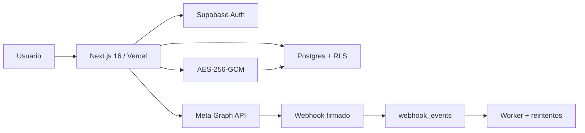

# Informe técnico final de producción — Estructura Digital SaaS

Fecha: 2026-07-30
Proyecto: `estructuradigitalspa-cmyks-projects/estruct`
Dominio: `https://estructuradigital.cl`
Supabase: `ocmcyhimhndlxlicojrs`
Commit verificado: `8e5ec1897c03f4926a7d5d24a19aa93f3b5f947d`

> Helplis no forma parte de este proyecto ni de este informe.

## Estado ejecutivo

La aplicación, la base y la configuración automatizable de Meta quedaron endurecidas y desplegadas. La migración productiva se aplicó con respaldo previo. El webhook de Meta quedó enlazado al dominio canónico y su handshake respondió HTTP 200. OAuth fue probado hasta la pantalla de consentimiento de Facebook; aceptar permisos, seleccionar activos y verificar la sesión de un usuario real requieren intervención humana.

## Arquitectura final

La organización activa se conserva en cookie HttpOnly, Secure y SameSite=Lax y se valida contra `organization_members`. Service role, secretos Meta y clave AES son exclusivos del servidor.

## Endpoints

| Método | Ruta | Control |
|---|---|---|
| POST | `/api/contact` | Schema, honeypot, rate limit/IP |
| GET/POST | `/api/meta/embedded-signup/session` | Auth, Owner/Admin, state, cookie, nonce, CSRF |
| GET | `/api/meta/oauth/start` | Auth, rol, state firmado |
| GET | `/api/meta/oauth/callback` | State/cookie |
| GET/POST | `/api/meta/webhook` | Verify token / HMAC SHA-256 |
| POST | `/api/meta/data-deletion` | signed_request y rate limit |
| GET | `/data-deletion/status/[code]` | Código opaco, respuesta mínima |
| POST | `/api/meta/disconnect`, `/api/meta/revalidate` | Auth, rol, CSRF, rate limit |
| POST | `/api/whatsapp/send` | Auth, rol, CSRF, límites usuario/organización |
| GET | `/api/whatsapp/status` | Auth y organización |
| GET | `/api/internal/webhook-worker` | Bearer `CRON_SECRET` |
| POST/PATCH/DELETE | `/api/organization/invitations`, `/api/organization/members` | Auth, rol, CSRF, RPC |
| GET | `/auth/callback` | PKCE Supabase |

## Variables — solo nombres

`NEXT_PUBLIC_SITE_URL`, `NEXT_PUBLIC_SUPABASE_URL`, `NEXT_PUBLIC_SUPABASE_ANON_KEY`, `SUPABASE_SERVICE_ROLE_KEY`, `META_LOGIN_APP_ID`, `META_LOGIN_APP_SECRET`, `META_BUSINESS_APP_ID`, `META_BUSINESS_APP_SECRET`, `META_BUSINESS_CONFIG_ID`, `META_GRAPH_API_VERSION`, `META_VERIFY_TOKEN`, `META_OAUTH_STATE_SECRET`, `META_TOKEN_ENCRYPTION_KEY_V1`, `META_TOKEN_ENCRYPTION_KEY_V2`, `META_TOKEN_ENCRYPTION_ACTIVE_VERSION`, `META_PHONE_NUMBER_ID`, `META_ACCESS_TOKEN`, `META_WABA_ID`, `ENABLE_GLOBAL_WHATSAPP_FALLBACK`, `RATE_LIMIT_CONTACT`, `RATE_LIMIT_WHATSAPP_USER`, `RATE_LIMIT_WHATSAPP_ORG`, `RATE_LIMIT_META_ATTEMPTS`, `RATE_LIMIT_DATA_DELETION`, `RESEND_API_KEY`, `CONTACT_FROM_EMAIL`, `CONTACT_TO_EMAIL`, `CRON_SECRET`, `WEBHOOK_WORKER_BATCH_SIZE`.

En Vercel Production se confirmó que las variables Supabase sensibles están configuradas y no vacías. No se imprimieron ni guardaron valores.

## OAuth, Embedded Signup y WhatsApp

OAuth: SaaS → Supabase → Facebook → `https://ocmcyhimhndlxlicojrs.supabase.co/auth/v1/callback` → Supabase → `https://estructuradigital.cl/auth/callback` → sesión.

Supabase URL Configuration:
- Site URL: `https://estructuradigital.cl`
- Redirect: `https://estructuradigital.cl/auth/callback`
- Desarrollo: `http://localhost:3000/auth/callback`

Embedded Signup usa el SDK oficial, state HMAC, cookie segura y nonce de un uso. El servidor valida usuario, rol y organización; canjea el código; valida Business/WABA/número; suscribe WABA; cifra el token y hace upsert multiempresa.

WhatsApp usa la credencial cifrada de la organización activa. El webhook minimiza y persiste idempotentemente; el worker reclama atómicamente, reintenta exponencialmente y deriva a dead-letter.

Webhook: `https://estructuradigital.cl/api/meta/webhook`. Campo `messages` suscrito en v26.0.

## Tablas y RLS

Tablas: `profiles`, `organizations`, `organization_members`, `organization_invitations`, `contacts`, `conversations`, `messages`, `pipelines`, `pipeline_stages`, `deals`, `tasks`, `integrations`, `integration_accounts`, `webhook_events`, `audit_logs`, `data_deletion_requests`, `oauth_nonces`, `rate_limit_buckets`.

RLS limita datos a miembros de la organización y escritura por rol. Integraciones, cuentas, miembros y auditoría requieren Owner/Admin. `encrypted_credentials` no se concede a `authenticated`; la vista segura lo excluye. Nonces y rate limits son service-role-only. RPC transaccionales protegen el último Owner.

## Webhook, cifrado y migración

Firma `X-Hub-Signature-256`; falla cerrado. Tokens AES-256-GCM con IV aleatorio de 96 bits y tag. Logs sanitizados sin secretos, códigos OAuth, signed_request, ciphertext ni payload completo.

Respaldo: schema `codex_backup_20260730_0900`, 15 tablas. Preflight: 0 duplicados de integraciones, 0 duplicados de mensajes, 0 organizaciones sin Owner y 0 webhooks pendientes. Migración `202607300004_production_hardening.sql` aplicada. Verificación posterior: 12/12 controles presentes.

## Pruebas y cobertura

- Lint y typecheck: aprobados.
- Tests: 108/108, 20 archivos.
- Build: aprobado, 38 rutas.
- Cobertura: 91.31% statements, 78.73% branches, 98.98% lines.
- PostgreSQL 17, migraciones desde cero y DB lint: aprobados.
- RLS multiempresa A/B con Owner/Admin/Agent/Viewer: aprobado.
- Producción: `/` 200; callback sin código 307; webhook inválido 403; handshake válido 200; worker 401/200; WhatsApp status 401; Embedded Session 401; Data Deletion GET 200.
- OAuth: Estructura Digital → Facebook con callback Supabase correcto.
- Headers: HSTS y `nosniff`.

## Auditoría priorizada

### Crítica

No se encontraron secretos productivos, service role, claves privadas ni tokens embebidos/versionados. Los patrones de fixtures son datos de prueba.

### Alta

Resueltos: aislamiento multiempresa, RLS excesiva, ciphertext visible, nonce reusable, state divergente, webhook fail-open, rate limiting, fallback global y errores Graph expuestos.

Pendiente upstream: dos hallazgos altos transitivos en `sharp@0.34.5` por Next 16.2.12. El fix automático fuerza downgrade incompatible a Next 14 y no se aplicó.

### Media

CSP conserva `'unsafe-inline'`; falta `RESEND_API_KEY`; cron Hobby recupera diariamente; conviene separar `META_LOGIN_APP_*` y `META_BUSINESS_APP_*`.

### Baja

Formalizar rotación versionada de la clave AES y conservar evidencias siempre sanitizadas.

## Checklists

Seguridad:
- [x] Secretos solo backend/Vercel; tokens cifrados.
- [x] State, expiración, nonce, CSRF, rate limit y RLS.
- [x] Webhook firmado/idempotente y worker autenticado.
- [x] Logs, respuestas y captura sanitizados.
- [ ] CSP con nonce; resolver Sharp compatible; rotación formal.

Despliegue:
- [x] Backup, preflight, migración, verificación y rollback preparado.
- [x] Variables Supabase no vacías y variables de seguridad configuradas.
- [x] Commit en Production Ready, dominio y endpoints verificados.
- [x] Webhook Meta actualizado y validado.
- [ ] Configurar Resend.
- [ ] Completar consentimiento OAuth y Embedded Signup manual.

## Pendientes para producción pública

1. Completar consentimiento Facebook y confirmar sesión, usuario y organización.
2. Completar Embedded Signup seleccionando Business, WABA y número.
3. Probar envío/recepción con número real.
4. Configurar Resend y probar contacto/invitaciones.
5. Separar credenciales de apps Login y Business.
6. Posteriormente: Business Verification, Technology Provider, Advanced Access, App Review y publicación. No se modificaron.

Evidencia: `docs/evidence/meta-webhook-production.png`.
